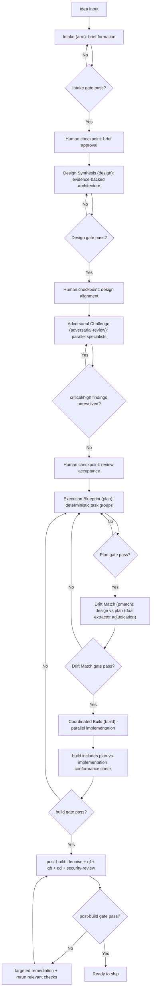
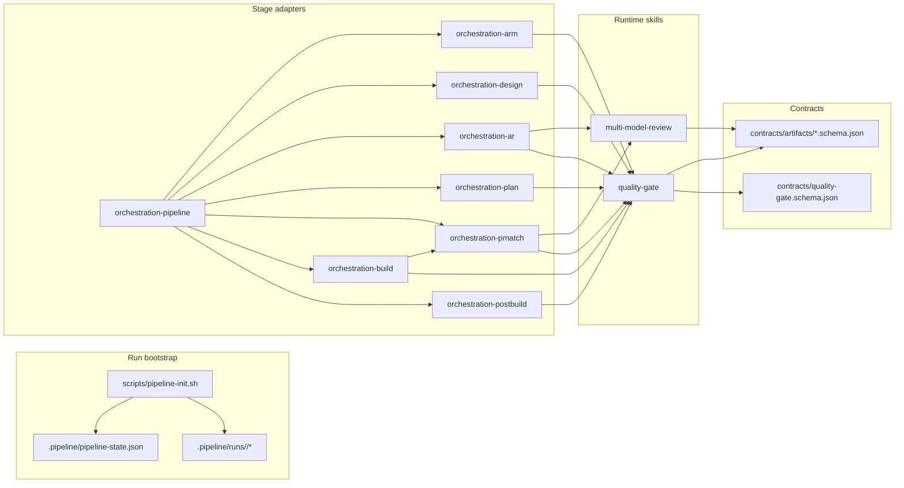

# Phased Agent Orchestration

This repository defines a practical way to ship software with AI agents without letting quality drift.

The system is built around one simple rule:
**no stage can move forward until its output is validated.**

Each stage has a clear job, a typed artifact, and a gate. This prevents the usual failure mode where planning, coding, and auditing blur together.

## Why This Architecture Exists

Many AI-assisted workflows fail for predictable reasons:
- ideas are vague when implementation starts,
- design choices are not grounded in current docs or real repo constraints,
- builders validate their own work,
- quality and security checks happen too late.

This orchestration addresses those problems directly:
- capture intent before design (Intake / `arm`),
- force evidence-backed design (Design Synthesis / `design`),
- pressure-test design from independent perspectives (Adversarial Challenge / `adversarial-review`),
- create deterministic build instructions (Execution Blueprint / `plan`),
- detect drift before and after coding (Drift Match / `pmatch`),
- separate implementation from audit (Coordinated Build / `build` + post-build checks),
- close security findings before shipping (`security-review` loop).

## Delivery Stages

```text
Intake -> Design Synthesis -> Adversarial Challenge -> Execution Blueprint -> Drift Match -> Coordinated Build -> post-build
Brief      Design            Review                   Plan                    Drift         Build              Quality + Security
```

Canonical phase aliases:
`arm -> design -> adversarial-review -> plan -> pmatch -> build -> post-build`

| Stage (alias) | Why this stage exists | Required output |
|---|---|---|
| Intake (`arm`) | Turn fuzzy input into explicit requirements and constraints. | `brief.json` |
| Design Synthesis (`design`) | Build the approach from validated facts, not assumptions. | `design.json` |
| Adversarial Challenge (`adversarial-review`) | Expose blind spots via independent specialist critique. | `review.json` |
| Execution Blueprint (`plan`) | Remove guesswork for builders with atomic, testable tasks. | `plan.json` |
| Drift Match (`pmatch`) | Detect source-vs-target drift using dual independent extractors. | `drift-reports/pmatch.json` |
| Coordinated Build (`build`) | Execute in parallel with strict scope boundaries and conformance checks. | build changes + `build-gate.json` |
| post-build | Run denoise + frontend/backend/docs/security audits before closure. | `quality-reports/*.json` + `postbuild-gate.json` |

## End-to-End Flow



## What Is New in the Current Orchestration

The current implementation strengthens existing behavior without reintroducing external model dependencies:

1. `pmatch` is first-class in Cursor via its own adapter:
- `.cursor/skills/orchestration-pmatch/SKILL.md`

2. Drift detection now supports **dual-extractor adjudication** (default in `pmatch`) with fallback heuristic mode:
- `drift_config.mode = "dual-extractor" | "heuristic"`
- exactly two `extractor_claim_sets` required in dual mode.

3. Drift artifacts now require explicit adjudication metadata:
- `mode`, `extractors`, `conflicts_resolved`, `resolution_policy`.

4. Fact-check closure is tighter in adversarial review:
- no critical/high finding can remain with `inconclusive` fact-check status.

5. Planning discipline is stronger but practical:
- target task-group size is 3-6,
- intentional deviations require `scope_override.reason`.

6. Design evidence is enforced at schema level:
- `research[].verified_at` is required.

7. Repo verify now includes orchestration integrity checks by default.

## Runtime Architecture



## Key Contracts (Strengthened)

- `contracts/artifacts/design-document.schema.json`
  - `research[].verified_at` is required.

- `contracts/artifacts/execution-plan.schema.json`
  - `task_groups[].scope_override.reason` is available for justified deviations from target task granularity.

- `contracts/artifacts/drift-report.schema.json`
  - `adjudication` is required.
  - `claims[].extractor` is required.
  - `claims[].confidence` is optional (0..1).

- `skills/dev-tools/multi-model-review/schemas/input.schema.json`
  - `drift_config.mode` supports `heuristic` and `dual-extractor`.
  - `dual-extractor` requires exactly two `extractor_claim_sets`.

- `skills/dev-tools/multi-model-review/schemas/output.schema.json`
  - drift output includes required `adjudication` metadata.

## Verification Model

`./scripts/verify.sh` runs:
1. skill validation,
2. stale reference checks,
3. orchestration integrity checks,
4. build+tests for runtime packages.

The orchestration integrity step (`scripts/check-orchestration-integrity.sh`) verifies:
- adapter presence for all pipeline stages,
- expected gate filenames per adapter,
- stage-order consistency between pipeline adapter and playbook,
- phase coverage in `contracts/quality-gate.schema.json`.

## Repository Layout

```text
.codex/skills/orchestration/          core orchestration playbook
.cursor/skills/orchestration-*/       8 Cursor adapters (arm, design, ar, plan, pmatch, build, post-build, pipeline)
contracts/artifacts/                  artifact schemas
contracts/quality-gate.schema.json    gate result schema
skills/dev-tools/quality-gate/        schema + criteria gate runtime
skills/dev-tools/multi-model-review/  review merge, cost/risk, drift adjudication runtime
scripts/pipeline-init.sh              run bootstrap
scripts/check-orchestration-integrity.sh
scripts/verify.sh                     repo verification entrypoint
docs/pipeline/                        pipeline state template
```

## API Independence

Runtime packages do not call paid model APIs and do not require API keys.

The system expects a runner that can:
- launch parallel worker contexts,
- read/write local artifacts,
- access live documentation/search tools when design/review phases need grounding.

## Using This Repo Across Runners

The contracts and runtime packages are runner-agnostic. Adapt only the orchestration layer per platform.

- Codex: use `.codex/skills/orchestration/SKILL.md`.
- Cursor: use `.cursor/skills/orchestration-*/` adapters.
- Any other runner: keep the same contracts, artifacts, and gate semantics.

## Requirements

- Node.js >= 20
- npm
- Python 3

## Quickstart

```bash
./scripts/verify.sh
./scripts/pipeline-init.sh
```

## Local Development

```bash
cd skills/dev-tools/quality-gate && npm ci && npm run build && npm test
cd skills/dev-tools/multi-model-review && npm ci && npm run build && npm test
```

## Deprecated Material

Legacy local-only files are moved to `deprecated/` and intentionally git-ignored.

## License

See `LICENSE`.
