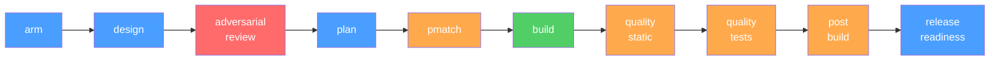
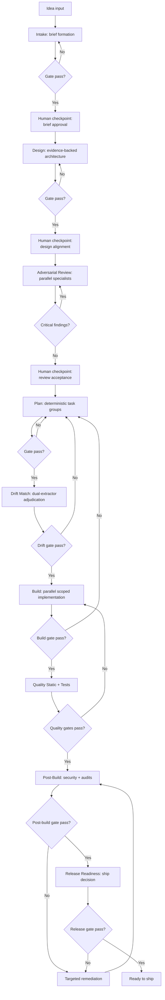
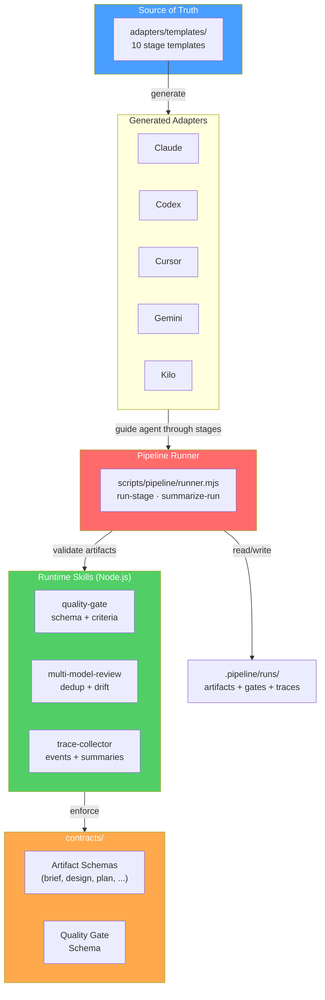

# Phased Agent Orchestration

A framework for shipping software with AI agents without letting quality drift. Each stage has a clear job, a typed artifact, and a gate — no stage moves forward until its output is validated.

## The Problem

AI-assisted development workflows typically fail for predictable reasons:

- Ideas are vague when implementation starts
- Design choices are not grounded in real repo constraints
- Builders validate their own work
- Quality and security checks happen too late

## The Solution

A 10-stage pipeline with strict gates, scoped context, and explicit handoffs:


```mermaid
flowchart LR
  A[arm] --> B[design]
  B --> C[adversarial\nreview]
  C --> D[plan]
  D --> E[pmatch]
  E --> F[build]
  F --> G[quality\nstatic]
  G --> H[quality\ntests]
  H --> I[post\nbuild]
  I --> J[release\nreadiness]

  style A fill:#4a9eff,color:#fff
  style B fill:#4a9eff,color:#fff
  style C fill:#ff6b6b,color:#fff
  style D fill:#4a9eff,color:#fff
  style E fill:#ffa94d,color:#fff
  style F fill:#51cf66,color:#fff
  style G fill:#ffa94d,color:#fff
  style H fill:#ffa94d,color:#fff
  style I fill:#ffa94d,color:#fff
  style J fill:#4a9eff,color:#fff
```

| Stage | Purpose | Output |
|-------|---------|--------|
| **Intake** (`arm`) | Turn fuzzy input into explicit requirements | `brief.json` |
| **Design** (`design`) | Evidence-backed architecture from validated constraints | `design.json` |
| **Adversarial Review** (`adversarial-review`) | Independent specialist critique from multiple perspectives | `review.json` |
| **Execution Plan** (`plan`) | Atomic, testable task groups with no ambiguity | `plan.json` |
| **Drift Match** (`pmatch`) | Dual-extractor drift detection between plan and implementation | `drift-reports/pmatch.json` |
| **Build** (`build`) | Parallel implementation with strict scope boundaries | `build-gate.json` |
| **Quality Static** (`quality-static`) | Lint, format, and type checks | `quality-static-gate.json` |
| **Quality Tests** (`quality-tests`) | Test verification | `quality-tests-gate.json` |
| **Post-Build** (`post-build`) | Security review, denoise, and audit aggregation | `postbuild-gate.json` |
| **Release Readiness** (`release-readiness`) | Semver, changelog, migration, rollback, and approvals | `release-readiness-gate.json` |

### Pipeline Flow with Gates and Human Checkpoints


```mermaid
flowchart TB
  A["Idea input"] --> B["Intake: brief formation"]
  B --> B_G{"Gate pass?"}
  B_G -- No --> B
  B_G -- Yes --> B_H["Human checkpoint:\nbrief approval"]

  B_H --> C["Design: evidence-backed architecture"]
  C --> C_G{"Gate pass?"}
  C_G -- No --> C
  C_G -- Yes --> C_H["Human checkpoint:\ndesign alignment"]

  C_H --> D["Adversarial Review: parallel specialists"]
  D --> D_G{"Critical findings?"}
  D_G -- Yes --> D
  D_G -- No --> D_H["Human checkpoint:\nreview acceptance"]

  D_H --> E["Plan: deterministic task groups"]
  E --> E_G{"Gate pass?"}
  E_G -- No --> E

  E_G -- Yes --> F["Drift Match: dual-extractor adjudication"]
  F --> F_G{"Drift gate pass?"}
  F_G -- No --> E
  F_G -- Yes --> G["Build: parallel scoped implementation"]
  G --> G_G{"Build gate pass?"}
  G_G -- No --> E
  G_G -- Yes --> H["Quality Static + Tests"]
  H --> H_G{"Quality gates pass?"}
  H_G -- No --> G
  H_G -- Yes --> I["Post-Build: security + audits"]
  I --> I_G{"Post-build gate pass?"}
  I_G -- No --> I_R["Targeted remediation"]
  I_R --> I
  I_G -- Yes --> J["Release Readiness: ship decision"]
  J --> J_G{"Release gate pass?"}
  J_G -- No --> I_R
  J_G -- Yes --> K["Ready to ship"]
```

## Key Design Principles

1. **Context scoping over context stuffing.** Each stage gets only the artifacts it needs, not the full conversation history. More context is not always better — information density matters.

2. **Hub-and-spoke over all-to-all.** Parallel workers (reviewers, builders, extractors) are coordinated by a lead, not connected to each other. This reduces coordination overhead from O(n²) to O(n).

3. **Gates reduce error propagation.** A defect caught at a gate costs less than one that compounds through downstream stages. Every stage has a required pass/fail gate.

> For the formal mathematical foundation behind these principles, see [`docs/SCIENTIFIC_FOUNDATION.md`](docs/SCIENTIFIC_FOUNDATION.md).

## Architecture

The system has two layers: **orchestration adapters** (agent guidance) and **runtime skills** (deterministic validation). A shared contract layer connects them.


```mermaid
flowchart TB
  subgraph Templates["Source of Truth"]
    T["adapters/templates/\n10 stage templates"]
  end

  subgraph Adapters["Generated Adapters"]
    direction LR
    Claude["Claude"]
    Codex["Codex"]
    Cursor["Cursor"]
    Gemini["Gemini"]
    Kilo["Kilo"]
  end

  subgraph Contracts["contracts/"]
    direction LR
    AS["Artifact Schemas\n(brief, design, plan, ...)"]
    QG["Quality Gate\nSchema"]
  end

  subgraph Skills["Runtime Skills (Node.js)"]
    direction LR
    QGS["quality-gate\nschema + criteria"]
    MMR["multi-model-review\ndedup + drift"]
    TC["trace-collector\nevents + summaries"]
  end

  subgraph Runner["Pipeline Runner"]
    CLI["scripts/pipeline/runner.mjs\nrun-stage · summarize-run"]
  end

  T -->|generate| Adapters
  Adapters -->|guide agent through stages| Runner
  Runner -->|validate artifacts| Skills
  Skills -->|enforce| Contracts
  Runner -->|read/write| State[".pipeline/runs/\nartifacts + gates + traces"]

  style Templates fill:#4a9eff,color:#fff
  style Contracts fill:#ffa94d,color:#fff
  style Skills fill:#51cf66,color:#fff
  style Runner fill:#ff6b6b,color:#fff
```

### Runtime Skills

| Package | Purpose |
|---------|---------|
| `quality-gate` | Schema validation + acceptance criteria evaluation |
| `multi-model-review` | Finding dedup, cost/benefit analysis, drift detection |
| `trace-collector` | Execution trace validation + run summaries |

All runtime packages are deterministic — they do not call external model APIs and do not require API keys.

## Getting Started

### Requirements

- Node.js >= 20
- npm
- Python 3

### Install and Verify

```bash
npm install
./scripts/verify.sh
```

### Initialize a Pipeline Run

```bash
./scripts/pipeline-init.sh
```

### Run a Stage

```bash
node scripts/pipeline/runner.mjs run-stage \
  --run-id <id> \
  --phase arm \
  --config-id phased_default
```

### Fast Verification (Changed Packages Only)

```bash
./scripts/verify.sh --changed-only
```

## Using with Different Runners

The contracts and runtime packages are runner-agnostic. Each supported runner has generated adapter files:

| Runner | Entry point |
|--------|-------------|
| Claude | `adapters/claude/skills/orchestration-pipeline/SKILL.md` |
| Codex | `adapters/codex/skills/orchestration-pipeline/SKILL.md` |
| Cursor | `adapters/cursor/skills/orchestration-pipeline/SKILL.md` |
| Gemini | `adapters/gemini/skills/orchestration-pipeline/SKILL.md` |
| Kilo | `adapters/kilo/skills/orchestration-pipeline/SKILL.md` |

To regenerate adapters after template changes:

```bash
python3 scripts/adapters/generate_adapters.py
python3 scripts/adapters/generate_adapters.py --check  # verify sync
```

## Documentation

| Document | Description |
|----------|-------------|
| [`docs/INDEX.md`](docs/INDEX.md) | Documentation navigation |
| [`docs/RUNBOOK.md`](docs/RUNBOOK.md) | Verification commands and troubleshooting |
| [`docs/SCIENTIFIC_FOUNDATION.md`](docs/SCIENTIFIC_FOUNDATION.md) | Formal mathematical model and research citations |
| [`docs/SCIENTIFIC_IMPLEMENTATION_MAP.md`](docs/SCIENTIFIC_IMPLEMENTATION_MAP.md) | Theory-to-code mapping |
| [`docs/PLATFORMS.md`](docs/PLATFORMS.md) | Platform adapter support model |
| [`docs/ORCHESTRATION_POLICY.md`](docs/ORCHESTRATION_POLICY.md) | Fan-out policy and budget controls |
| [`docs/REPO_MAP.md`](docs/REPO_MAP.md) | Directory and file organization |

## Contributing

- Run `./scripts/verify.sh` before submitting changes
- Keep diffs small and focused
- Artifacts validate against `contracts/artifacts/*.schema.json`
- See [`AGENTS.md`](AGENTS.md) for detailed repository rules

## License

[MIT](LICENSE)
